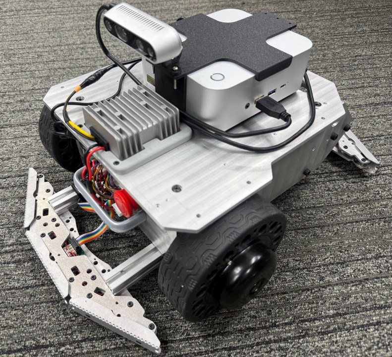
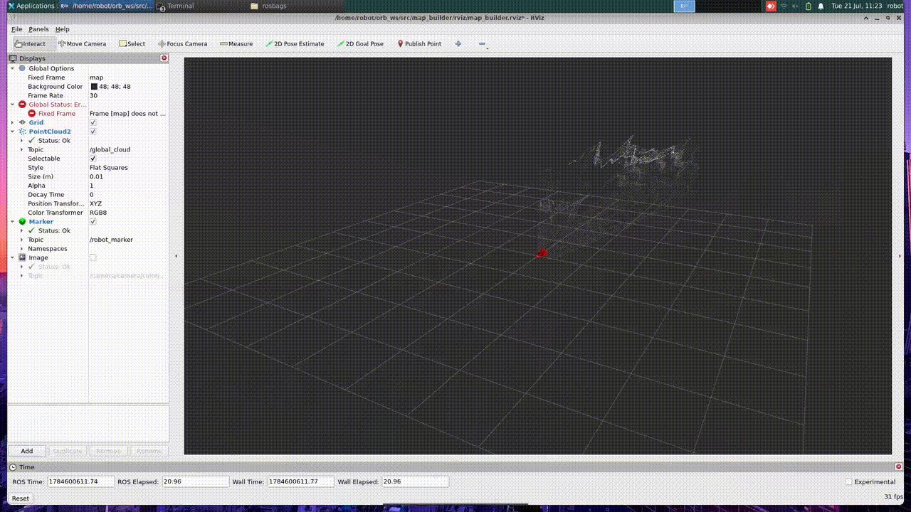

# megarover-v3-orbslam3

**Indoor localization & mapping with a Vstone MegaRover V3 using ORB-SLAM3 (RGB-D) fused with the rover's wheel odometry.**




A complete ROS 2 (Humble) stack that runs **ORB-SLAM3** on an Intel RealSense D435 (RGB-D)
mounted on a **Vstone MegaRover Ver.3.0**. The visual SLAM pose (`/orb_pose`) is combined
with the rover's odometry (micro-ROS base, `/rover_odo`) for robust indoor localization,
while a custom `map_builder` node accumulates the registered RGB-D point clouds into a
global map visualized in RViz. One launch file brings up the entire system and records
everything to rosbag (MCAP).

| Real robot | SLAM + mapping in RViz |
|---|---|
|  |  |

---

## Table of Contents

- [Overview](#overview)
- [Features](#features)
- [Hardware](#hardware)
- [System Architecture](#system-architecture)
- [Workspace Layout](#workspace-layout)
- [Repository Contents](#repository-contents)
- [Prerequisites](#prerequisites)
- [Installation](#installation)
  - [0. ROS 2 Humble + common dependencies](#0-ros-2-humble--common-dependencies)
  - [1. ORB-SLAM3 → `~/ORB_SLAM3`](#1-orb-slam3--orb_slam3)
  - [2. micro-ROS Agent → `~/uros_ws` (MegaRover V3 base)](#2-micro-ros-agent--uros_ws-megarover-v3-base)
  - [3. This repository → `~/orb_ws` + `~/ros2_ws`](#3-this-repository--orb_ws--ros2_ws)
  - [4. Environment setup](#4-environment-setup)
- [Usage](#usage)
- [Topics](#topics)
- [Checking your Pangolin version](#checking-your-pangolin-version)
- [Troubleshooting](#troubleshooting)
- [License](#license)
- [Acknowledgments](#acknowledgments)

---

## Overview

The MegaRover V3 base runs Vstone's **micro-ROS firmware**, exposing the rover's sensors
and motor interface to the ROS 2 network through a serial micro-ROS Agent (115200 baud).
On top of that, this project adds vision-based localization and mapping:

1. **RealSense D435** streams aligned color + depth (`realsense2_camera`).
2. **ORB-SLAM3** (RGB-D mode, via the `orbslam3` ROS 2 wrapper) tracks the camera and
   publishes `/orb_pose`.
3. **`map_builder`** accumulates the point clouds into a global map (`/global_cloud`)
   and publishes a robot marker for RViz.
4. **`rover_controller`** computes the rover odometry (`/rover_odo`, `/tf`) and drives
   the base (`/rover_twist`) toward goals sent from RViz (`/goal_pose`).
5. **rosbag2 (MCAP)** records all relevant topics automatically for offline analysis.

## Features

- 🎯 **Visual SLAM localization** — ORB-SLAM3 RGB-D pose on a differential rover, no GPS
- 🗺️ **Online global mapping** — accumulated RGB-D point cloud map in RViz
- 🤖 **Odometry fusion-friendly design** — wheel odometry from the micro-ROS base is kept
  on separate topics (`/rover_odo`, `/rover_twist`) so it can be fused or compared with
  `/orb_pose`
- 🚀 **Single launch file** — staggered bring-up of agent → camera → SLAM → mapper →
  RViz → rosbag → rover controller
- 💾 **Automatic data logging** — MCAP rosbags with timestamps for replay/tuning

## Hardware

| Component | Notes |
|---|---|
| **Vstone MegaRover Ver.3.0** | Differential-drive base, micro-ROS firmware (ESP32), serial @ 115200 |
| **Intel RealSense D435** | RGB-D camera, 640×480 @ 30 Hz, aligned depth + point cloud |
| **Onboard PC** | Ubuntu 22.04 x86_64 (e.g. NUC / laptop on the rover) |
| USB cables | Base serial (`/dev/ttyUSB0`) + D435 (USB3) |

## System Architecture

```mermaid
flowchart LR
    D435[RealSense D435] -->|USB3| RS[realsense2_camera]
    BASE[MegaRover V3 base<br/>micro-ROS firmware] <-->|USB serial 115200| AGENT[micro_ros_agent]

    subgraph PC["ROS 2 Humble — onboard PC"]
        RS -->|/camera/camera/color/image_raw<br/>/camera/camera/aligned_depth_to_color/image_raw| SLAM[orbslam3 rgbd<br/>ORB-SLAM3]
        SLAM -->|/orb_pose| MB[map_builder]
        RS -->|/camera/camera/depth/color/points| MB
        MB -->|/global_cloud<br/>/robot_marker| RVIZ[RViz<br/>map_builder.rviz]
        RVIZ -->|/goal_pose /initialpose| RC[rover_controller]
        AGENT <-->|base sensors / cmd| RC
        RC -->|/rover_odo /tf<br/>/rover_sensor /rover_twist| RVIZ
        SLAM -->|/orb_pose| RC
        BAG[rosbag2 — MCAP recorder] -.records all topics.- PC
    end
```

## Workspace Layout

The project is spread across four workspaces (this is intentional — each has a separate
build/lifecycle):

| Path | Purpose | Built with |
|---|---|---|
| `~/ORB_SLAM3` | ORB-SLAM3 library (original, from UZ-SLAMLab) — **not** a ROS package | `build.sh` (CMake) |
| `~/orb_ws` | Mapping workspace: `ORB_SLAM3_ROS2` (ROS 2 wrapper linked to `~/ORB_SLAM3`), `map_builder` (custom mapping + RViz config) | `colcon` |
| `~/ros2_ws` | Rover workspace: `rover_control` (odometry program + bring-up launch file) | `colcon` |
| `~/uros_ws` | micro-ROS Agent workspace for the MegaRover V3 base (Vstone original setup) | `colcon` + `micro_ros_setup` |

```
~/
├── ORB_SLAM3/            # clone from UZ-SLAMLab (step 1)
├── orb_ws/               # ROS 2 — SLAM + mapping
│   ├── config/
│   │   └── d435_rgbd.yaml          <- from this repo
│   └── src/
│       ├── map_builder/            <- from this repo (incl. rviz/map_builder.rviz)
│       └── ORB_SLAM3_ROS2/         <- from this repo (wrapper, links ~/ORB_SLAM3)
├── ros2_ws/              # ROS 2 — rover
│   └── src/
│       └── rover_control/          <- from this repo (odometry + bring-up launch)
└── uros_ws/              # micro-ROS agent (step 2)
    └── src/micro_ros_setup/
```

## Repository Contents

```
megarover-v3-orbslam3/
├── config/
│   └── d435_rgbd.yaml        # ORB-SLAM3 RGB-D camera config for the D435
├── imgs/
│   ├── iso.jpg               # robot photo (used in this README)
│   ├── robot.gif             # real-robot demo
│   └── slam.gif              # SLAM/mapping demo
├── map_builder/              # -> ~/orb_ws/src/map_builder
│   └── rviz/
│       └── map_builder.rviz  # RViz config loaded by the launch file
├── ORB_SLAM3_ROS2/           # -> ~/orb_ws/src/ORB_SLAM3_ROS2 (orbslam3 ROS 2 wrapper)
├── rover_control/            # -> ~/ros2_ws/src/rover_control
│   └── launch/
│       └── rover_bringup_launch.py   # full-system bring-up (see Usage)
├── install.sh                # spreads everything into the workspaces (+ optional build)
├── LICENSE                   # GPLv3
└── README.md
```

## Prerequisites

- Ubuntu **22.04** (Jammy), x86_64
- **ROS 2 Humble** (desktop install) — <https://docs.ros.org/en/humble/Installation.html>
- `git`, `colcon`, `rosdep`
- ~8 GB free disk space, ≥ 8 GB RAM recommended for building ORB-SLAM3

## Installation

### 0. ROS 2 Humble + common dependencies

```bash
sudo apt update
sudo apt install -y ros-humble-realsense2-camera \
                    ros-humble-rosbag2-storage-mcap \
                    python3-colcon-common-extensions \
                    python3-rosdep \
                    build-essential cmake git rsync

# Serial port access for the rover base (/dev/ttyUSB0) — re-login afterwards
sudo usermod -aG dialout $USER
```

> `ros-humble-rosbag2-storage-mcap` is required on Humble for `--storage mcap`
> (on Jazzy+, MCAP is the default storage).

### 1. ORB-SLAM3 → `~/ORB_SLAM3`

ORB-SLAM3 is a plain CMake library (not a ROS package) and lives in your home
directory. **Pangolin v0.6** is the version known to build cleanly with ORB-SLAM3 —
newer Pangolin releases (0.8/0.9) often fail (see
[Checking your Pangolin version](#checking-your-pangolin-version)).

```bash
# --- Pangolin v0.6 (visualization dependency of ORB-SLAM3) ---
sudo apt install -y libglew-dev libgl1-mesa-dev libegl1-mesa-dev \
                    wayland-protocols libwayland-dev libxkbcommon-dev
git clone https://github.com/stevenlovegrove/Pangolin.git ~/Pangolin
cd ~/Pangolin && git checkout v0.6
mkdir build && cd build
cmake .. -DBUILD_EXAMPLES=OFF
make -j$(nproc)
sudo make install && sudo ldconfig

# --- Dependencies of ORB-SLAM3 itself ---
sudo apt install -y libeigen3-dev libopencv-dev libboost-serialization-dev

# --- ORB-SLAM3 ---
git clone https://github.com/UZ-SLAMLab/ORB_SLAM3.git ~/ORB_SLAM3
cd ~/ORB_SLAM3

# The vocabulary ships compressed on GitHub — extract it (needed by rgbd node)
cd Vocabulary && tar -xf ORBvoc.txt.tar.gz && cd ..

chmod +x build.sh
./build.sh          # takes a while; see Troubleshooting on low-memory machines
```

Sanity check afterwards:

```bash
ls ~/ORB_SLAM3/lib/libORB_SLAM3.so
ls ~/ORB_SLAM3/Vocabulary/ORBvoc.txt
```

### 2. micro-ROS Agent → `~/uros_ws` (MegaRover V3 base)

The MegaRover V3 base already runs Vstone's micro-ROS firmware — on the PC side you only
need the **micro-ROS Agent** (same setup as Vstone's official
[megarover3_ros2](https://github.com/vstoneofficial/megarover3_ros2) documentation):

```bash
source /opt/ros/humble/setup.bash
mkdir -p ~/uros_ws/src && cd ~/uros_ws/src
git clone -b $ROS_DISTRO https://github.com/micro-ROS/micro_ros_setup.git
cd ~/uros_ws
rosdep update && rosdep install --from-paths src --ignore-src -y
colcon build
source install/local_setup.bash

# Build the agent
ros2 run micro_ros_setup create_agent_ws.sh
ros2 run micro_ros_setup build_agent.sh
source install/local_setup.bash
```

Test it with the rover connected (power on the base first):

```bash
ros2 run micro_ros_agent micro_ros_agent serial --dev /dev/ttyUSB0 -b 115200 -v4
# (long option form `--baudrate 115200` is also accepted)
ros2 topic list   # rover topics should appear
```

### 3. This repository → `~/orb_ws` + `~/ros2_ws`

Clone the repo anywhere and run **`install.sh`** — it copies each package into the
correct workspace (and optionally builds them):

```bash
git clone https://github.com/<your-username>/megarover-v3-orbslam3.git
cd megarover-v3-orbslam3

./install.sh            # copy files only
# or
./install.sh --build    # copy + colcon build orb_ws and ros2_ws
```

| Repo path | Installed to |
|---|---|
| `config/d435_rgbd.yaml` | `~/orb_ws/config/d435_rgbd.yaml` |
| `map_builder/` | `~/orb_ws/src/map_builder/` |
| `ORB_SLAM3_ROS2/` | `~/orb_ws/src/ORB_SLAM3_ROS2/` |
| `rover_control/` | `~/ros2_ws/src/rover_control/` |
| `imgs/` | *(stays in the repo; GitHub README only)* |

Custom locations are supported via environment variables:

```bash
ORB_WS=~/my_orb_ws ROS2_WS=~/my_ros2_ws ./install.sh --build
```

> **Wrapper path check:** the `orbslam3` CMake target must point at your ORB-SLAM3
> checkout. This repository's copy is configured for `~/ORB_SLAM3`; if yours lives
> elsewhere, adjust the ORB-SLAM3 path in `ORB_SLAM3_ROS2/CMakeLists.txt`.

To build manually instead of using `--build`:

```bash
source /opt/ros/humble/setup.bash
cd ~/orb_ws  && colcon build --symlink-install --cmake-args -DCMAKE_BUILD_TYPE=Release
cd ~/ros2_ws && colcon build --symlink-install
```

### 4. Environment setup

Add to `~/.bashrc` so every terminal has the full stack:

```bash
echo '
source /opt/ros/humble/setup.bash
source ~/uros_ws/install/local_setup.bash
source ~/orb_ws/install/setup.bash
source ~/ros2_ws/install/setup.bash' >> ~/.bashrc
source ~/.bashrc
```

## Usage

1. Power on the MegaRover V3 base, connect its USB-serial cable (`/dev/ttyUSB0`) and
   the D435 (USB3) to the onboard PC.
2. Launch **everything** with one command:

   ```bash
   ros2 launch rover_control rover_bringup_launch.py
   ```

   The launch file starts the components in a staggered sequence:

   | t (s) | Component |
   |---:|---|
   | 0 | micro-ROS Agent (`serial --dev /dev/ttyUSB0 --baudrate 115200 -v4`) |
   | 0 | RealSense D435 (`rs_launch.py`, aligned depth, point cloud, 640×480@30) |
   | 5 | ORB-SLAM3 (`ros2 run orbslam3 rgbd Vocabulary/ORBvoc.txt ~/orb_ws/config/d435_rgbd.yaml`) |
   | 10 | `map_builder` (global map + robot marker) |
   | 12 | RViz (`map_builder.rviz`) |
   | 14 | rosbag2 recorder (MCAP) |
   | 16 | `rover_controller` (odometry + base command) |

3. In RViz, watch `/orb_pose`, `/global_cloud` and `/rover_odo`. Send a
   **2D Goal Pose** (`/goal_pose`) to drive the rover with the fused pose feedback.
4. Rosbags are written to `/home/robot/rosbags/<timestamp>/` — **edit the path in
   `rover_bringup_launch.py` if your username is not `robot`**.

## Topics

| Topic | Type | Meaning |
|---|---|---|
| `/orb_pose` | `geometry_msgs/PoseStamped` | ORB-SLAM3 camera pose (visual localization) |
| `/global_cloud` | `sensor_msgs/PointCloud2` | Accumulated global RGB-D map (`map_builder`) |
| `/robot_marker` | `visualization_msgs/Marker` | Robot marker for RViz |
| `/rover_odo` | `nav_msgs/Odometry` | Rover wheel odometry (`rover_controller`) |
| `/rover_sensor` | sensor states | Base sensors via micro-ROS (battery, bumps, …) |
| `/rover_twist` | `geometry_msgs/Twist` | Velocity command to the base |
| `/goal_pose`, `/initialpose` | RViz tools | Goal / pose estimate |
| `/camera/camera/color/image_raw` | color stream | RealSense D435 |
| `/camera/camera/aligned_depth_to_color/image_raw` | aligned depth | RealSense D435 (used by SLAM) |
| `/camera/camera/depth/color/points` | point cloud | RealSense D435 |
| `/tf`, `/tf_static` | transforms | odom/base/camera frames |

## Checking your Pangolin version

ORB-SLAM3 is built against a specific Pangolin API, so it helps to know which version
you have installed. Any of these works (in order of reliability):

```bash
# 1) If you still have the source clone — the most reliable way:
git -C ~/Pangolin describe --tags        # e.g. "v0.6", "v0.8", "v0.9.1"

# 2) Version macros in the installed header (Pangolin ≥ 0.8 only;
#    no match ⇒ v0.6 or older):
grep -E "PANGOLIN_VERSION_(MAJOR|MINOR)" /usr/local/include/pangolin/pangolin.h

# 3) pkg-config (only present on some installs):
pkg-config --modversion pangolin

# 4) CMake cache of your build:
grep -i pangolin_version ~/Pangolin/build/CMakeCache.txt
```

**Recommendation:** use **Pangolin v0.6** with ORB-SLAM3. If you see Pangolin-related
compile errors (e.g. C++17/`register` keyword errors from Pangolin headers while building
ORB-SLAM3), you are on a newer release — fix it with:

```bash
cd ~/Pangolin && git checkout v0.6
rm -rf build && mkdir build && cd build
cmake .. -DBUILD_EXAMPLES=OFF && make -j$(nproc) && sudo make install && sudo ldconfig
```

## Troubleshooting

| Symptom | Fix |
|---|---|
| `ORBvoc.txt` not found / SLAM exits immediately | Extract the vocabulary: `cd ~/ORB_SLAM3/Vocabulary && tar -xf ORBvoc.txt.tar.gz` |
| Pangolin header errors while building ORB-SLAM3 | Downgrade to Pangolin v0.6 (see above), or build ORB-SLAM3 with C++17 |
| `colcon build` of `orbslam3` fails to find ORB-SLAM3 | Fix the ORB-SLAM3 path in `ORB_SLAM3_ROS2/CMakeLists.txt` (expects `~/ORB_SLAM3`) |
| Build killed on low-RAM machine | `MAKEFLAGS="-j2" colcon build` / edit ORB-SLAM3 `build.sh` from `-j` to `-j2` |
| `serial: /dev/ttyUSB0: Permission denied` | `sudo usermod -aG dialout $USER`, re-login (or replug USB) |
| Agent starts but no rover topics | Power-cycle the base; keep the micro-ROS Agent start order (agent starts first in the launch file) |
| `ros2 bag record: No storage plugin found with id 'mcap'` | `sudo apt install ros-humble-rosbag2-storage-mcap` |
| RViz shows no map/pose | `ros2 topic echo /orb_pose --once` — if silent, check D435 streams with `ros2 topic hz /camera/camera/color/image_raw` |
| Camera topics don't match your wrapper | This project uses the newer RealSense wrapper topics (`/camera/camera/...`); older wrappers use `/camera/...` without the nested namespace |
| Rosbag path errors | The launch file records to `/home/robot/rosbags` — change it to your user's home |

## License

This repository is released under the **GNU GPLv3** — see [LICENSE](LICENSE).

Note on dependencies: ORB-SLAM3 itself is GPLv3 (© UZ-SLAMLab), which is why this
project (including the `orbslam3` wrapper that links against it) is GPLv3.
Pangolin is MIT; Vstone's `megarover3_ros2` and Intel's RealSense wrapper are
Apache-2.0 — you install those from their own repositories.

## Acknowledgments

- [UZ-SLAMLab/ORB_SLAM3](https://github.com/UZ-SLAMLab/ORB_SLAM3) — ORB-SLAM3 library
- [zang09/ORB_SLAM3_ROS2](https://github.com/zang09/ORB_SLAM3_ROS2) — the ROS 2 wrapper
  this project is based on (`orbslam3` package, `ros2 run orbslam3 rgbd ...`)
- [vstoneofficial/megarover3_ros2](https://github.com/vstoneofficial/megarover3_ros2) —
  MegaRover Ver.3.0 ROS 2 packages & micro-ROS setup (Vstone Co., Ltd.)
- [micro-ROS](https://micro.ros.org/) — micro_ros_setup / micro_ros_agent
- [Intel RealSense ROS wrapper](https://github.com/IntelRealSense/realsense-ros)
